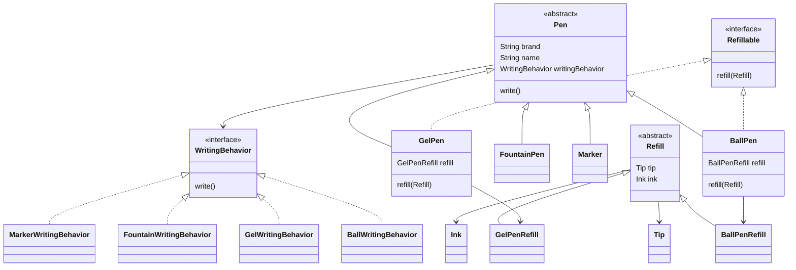

# Pen Design (LLD)

## Problem Statement

Design and implement a Pen system that supports different types of pens such as Ball Pen, Gel Pen, Fountain Pen, and Marker, with different writing behaviors and refill capabilities.

## Requirements

- Support different types of pens.
- Every pen should support a `write()` operation.
- Different pens can have different writing behaviors.
- Some pens should support refilling.
- A pen should accept only its compatible refill type.
- The design should be easily extensible for new pen types and writing behaviors.
- Follow SOLID principles and maintain loose coupling.

## Core Entities

- **Pen**: Abstract base class containing common pen properties and writing behavior.
- **BallPen**: A refillable pen using ball writing behavior.
- **GelPen**: A refillable pen using gel writing behavior.
- **FountainPen**: Uses fountain writing behavior.
- **Marker**: Uses marker writing behavior.
- **WritingBehavior**: Interface defining the writing operation.
- **Refillable**: Interface for pens that support refilling.
- **Refill**: Abstract class representing a pen refill.
- **BallPenRefill**: Refill compatible with Ball Pen.
- **GelPenRefill**: Refill compatible with Gel Pen.
- **Ink**: Represents ink information.
- **Tip**: Represents refill tip information.

## Class Design

### 1. Pen

**Fields:**

- `brand`
- `name`
- `writingBehavior`

**Methods:**

- `write()`

`Pen` delegates the writing operation to the configured `WritingBehavior`.

### 2. WritingBehavior

Interface responsible for defining pen writing behavior.

Implementations:

- `BallWritingBehavior`
- `GelWritingBehavior`
- `FountainWritingBehavior`
- `MarkerWritingBehavior`

### 3. Refillable

Interface for pens that support refilling.

**Method:**

- `refill(Refill refill)`

Implemented by:

- `BallPen`
- `GelPen`

### 4. Refill

Abstract class containing common refill components:

- `Tip`
- `Ink`

Implementations:

- `BallPenRefill`
- `GelPenRefill`

## UML Class Diagram



## Design Pattern

### Strategy Pattern

The project uses the **Strategy Pattern** for writing behavior.

Instead of putting different writing implementations inside `Pen`, the behavior is extracted into the `WritingBehavior` interface.

```text
Pen
 |
 +-- WritingBehavior
       |
       +-- BallWritingBehavior
       +-- GelWritingBehavior
       +-- FountainWritingBehavior
       +-- MarkerWritingBehavior
```

This makes it easy to introduce a new writing behavior without modifying the `Pen` class.

## SOLID Principles

- **SRP** – Each class has a focused responsibility.
- **OCP** – New writing behaviors can be added without modifying existing code.
- **LSP** – Different pen implementations can be treated as `Pen`.
- **ISP** – Refill capability is separated into the `Refillable` interface.
- **DIP** – `Pen` depends on the `WritingBehavior` abstraction.

## Example Usage

```java
WritingBehavior ballBehavior = new BallWritingBehavior();

Pen ballPen = new BallPen(
        "Reynolds",
        "Ball Pen",
        ballBehavior
);

ballPen.write();
```

For a refillable pen:

```java
BallPenRefill refill =
        new BallPenRefill(tip, ink);

ballPen.refill(refill);
```

## Extending the Design

The design can be extended by adding:

- New pen types
- New writing behaviors
- New refill types
- New pen capabilities
- Pen Factory for object creation
- Additional pen features such as cap/open-close behavior

### Key Learning

The main design principle used here is:

> **Separate what changes from what remains common.**

Common pen properties stay in `Pen`, while variable writing behavior is separated using the Strategy Pattern.
